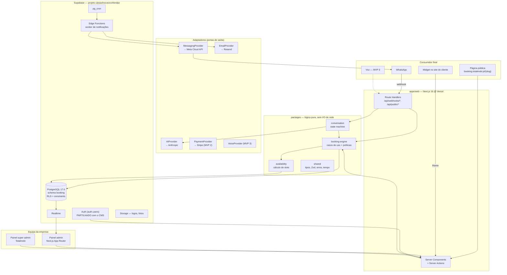
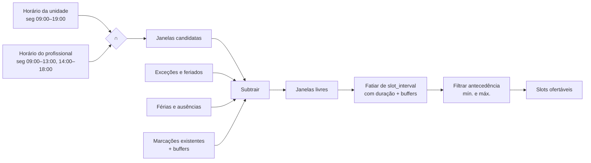
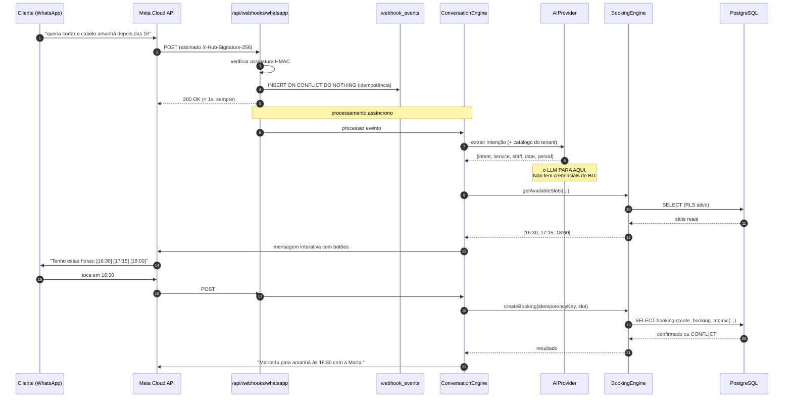
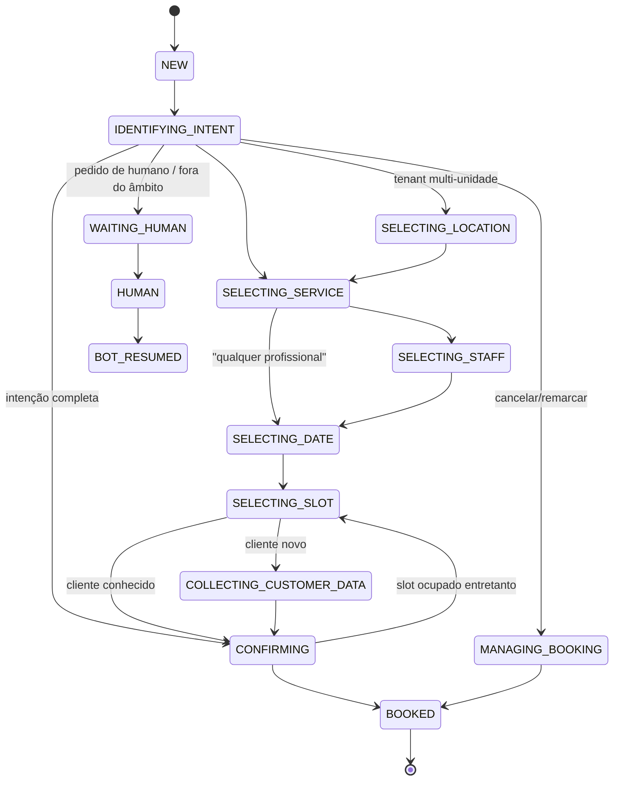
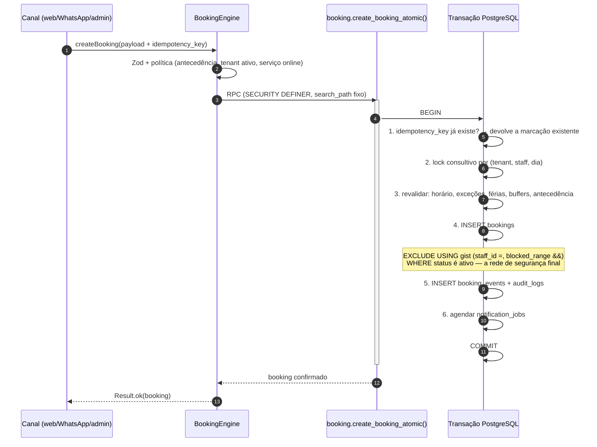
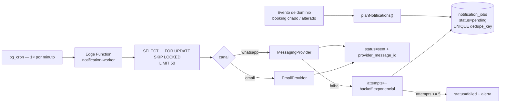
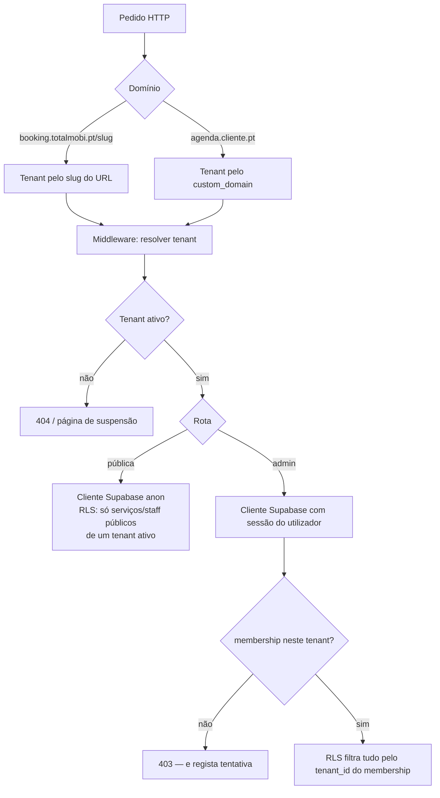
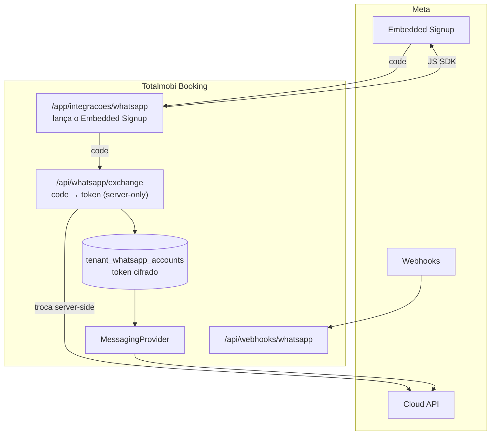

# Totalmobi Booking — Arquitetura

> Versão 1.0 — 2026-08-17. Documento vivo.
> Ler primeiro: [PRODUCT_REQUIREMENTS.md](PRODUCT_REQUIREMENTS.md).
> Detalhe de dados: [DATABASE.md](DATABASE.md). Segurança: [SECURITY.md](SECURITY.md).

---

## 1. As quatro ideias que sustentam tudo

Se este documento se perder e sobrarem quatro frases, que sejam estas.

1. **A base de dados é a autoridade.** Disponibilidade, políticas de
   cancelamento e isolamento entre empresas são garantidos por constraints e
   RLS no PostgreSQL. A aplicação é uma conveniência por cima; o frontend não
   garante nada.

2. **Um motor, muitos canais.** Web, WhatsApp, widget e voz são adaptadores
   finos à volta do mesmo `BookingEngine`. Se uma regra existir em dois sítios,
   é um bug.

3. **O LLM interpreta, não decide.** O modelo transforma linguagem em intenção
   estruturada e transforma resultados em prosa. Entre as duas coisas está
   código determinístico e testado.

4. **A disponibilidade mostrada é uma sugestão; só a transação é verdade.**
   Todo o slot é revalidado dentro da transação que o reserva.

---

## 2. Vista de contentores



**Regra de dependência:** as setas dentro de `packages` apontam sempre para
dentro. `availability` e `shared` não conhecem Supabase, nem HTTP, nem React.
`booking-engine` conhece interfaces de repositório, não o cliente Supabase.
Só `apps/web` e `packages/database` conhecem o Supabase.

---

## 3. Stack — escolhas e verificação

Versões verificadas no registo npm a 2026-08-17.

| Camada | Escolha | Versão | Licença | Nota |
|---|---|---|---|---|
| Framework | Next.js (App Router) | `16.3.1` | MIT | Server Actions + Route Handlers |
| UI | React | `19.2.8` | MIT | — |
| Linguagem | TypeScript | **`5.9.3`** | Apache-2.0 | ver nota abaixo |
| CSS | Tailwind CSS | `4.3.3` | MIT | via `@tailwindcss/postcss` |
| Validação | Zod | `4.4.3` | MIT | fronteira de todo o input |
| Datas | Luxon | `3.7.2` | MIT | ver nota abaixo |
| Cliente BD | `@supabase/supabase-js` | `2.112.3` | MIT | — |
| Auth SSR | `@supabase/ssr` | `0.12.4` | MIT | cookies em RSC/middleware |
| Estado servidor | TanStack Query | `5.101.4` | MIT | só no painel |
| Testes | Vitest | `4.1.10` | MIT | — |
| i18n | next-intl | `4.13.6` | MIT | ver nota abaixo |
| Email | Resend SDK | `6.20.0` | MIT | atrás de `EmailProvider` |
| Runtime | Node | `22.18.0` (local) | — | Vercel: Node 22 |
| Gestor de pacotes | **npm workspaces** `10.9.3` | — | — | pnpm não está instalado nesta máquina; npm workspaces chega para 4 pacotes |

### Notas de decisão

**TypeScript 5.9 e não 7.0.** O TS 7.0.2 (a reimplementação nativa) é a versão
`latest` no npm. Não o adotamos no arranque: o ecossistema à volta —
`typescript-eslint`, os transformadores do Next, os plugins de editor — leva
meses a estabilizar num salto de major deste tamanho, e um erro de type-check
espúrio num projeto novo custa mais do que o ganho de velocidade de compilação.
Fica registado como **dívida técnica deliberada**: reavaliar quando
`eslint-config-next` declarar suporte explícito.

**Luxon e não `date-fns`/`Temporal`.** A aritmética aqui é toda com fusos IANA e
DST — "adicionar 45 minutos em Lisboa no último domingo de outubro" tem de estar
certo. O Luxon foi desenhado para isso e é a escolha madura. O `Temporal` nativo
é o futuro, mas isolamos tudo em `packages/shared/time` para que a troca seja
um ficheiro.

**next-intl e não `react-i18next`.** Integra-se com o App Router e com segmentos
de rota `[locale]`, e faz a tradução funcionar em Server Components sem hidratar
o dicionário todo para o browser.

**Sem `shadcn/ui` copiado às cegas.** Usamos **Radix Primitives** diretamente
para o comportamento acessível (foco, teclado, ARIA) e escrevemos o nosso
`packages/ui` por cima. O shadcn é ótimo, mas o seu visual por omissão é
exatamente o "dashboard genérico" que o briefing proíbe — e depois de o copiar,
sobra um design system que se parece com metade da internet.

---

## 4. Onde vive a base de dados

**Decisão:** schema `booking` dentro do projeto Supabase existente
`ulpsaxhocvezcohbndpz` (PostgreSQL 17.6), a par do `public` do Totalmobi CMS.
Instrução direta do Sérgio. É o mesmo padrão já validado no schema `golf` do
projeto da ABGS.

**O que ganhamos:** zero custo de projeto novo, um só backup, e um eventual
cruzamento futuro CMS ↔ Booking é um JOIN e não um ETL. Desfaz-se com
`DROP SCHEMA booking CASCADE`.

**O que isto obriga — e é crítico:**

> O pool de `auth.users` é **partilhado** com o Totalmobi CMS. São hoje 15
> contas reais (medido a 2026-08-17); as 10.836 linhas de `public.tot_users`
> são uma whitelist de emails com direito a registar-se, não contas. O pool
> cresce em direção a esses milhares à medida que as apps do CMS forem usadas.
> Qualquer titular de uma dessas contas obtém um JWT válido `authenticated`
> contra este projeto.

Consequência direta: **nenhuma política RLS no schema `booking` pode usar
`authenticated` como sinal de autorização.** Autenticado significa apenas "é uma
pessoa"; não significa "pertence a este tenant". Toda a autorização passa por
`booking.memberships`. Isto está imposto nas políticas e coberto por testes
— ver [SECURITY.md](SECURITY.md#3-o-pool-de-auth-partilhado).

### 4.1 Ficar ou mudar de projeto

Questão levantada a 2026-08-17, depois de se perceber que o `auth.users` é
partilhado. **Decisão: ficar.** A justificação interessa mais do que a decisão,
porque contraria o instinto.

**O argumento que parecia decisivo e não é.** "Um projeto dedicado eliminava a
ameaça T2." Não eliminava. O Booking é multi-tenant por natureza: mesmo num
projeto só dele, um utilizador da Clínica Sorriso não pode ler a agenda do
Studio Bella. Ou seja, **a autorização por `booking.memberships` é obrigatória
de qualquer forma** — e é ela que fecha o T2 como efeito secundário.

Mudar de projeto não permitiria simplificar uma única política. Reduziria
apenas o número de pessoas que passariam por uma porta que, se estiver bem
fechada, não deixa passar ninguém.

**O que a partilha custa de facto:**

| Custo real | Gravidade |
|---|---|
| Limites de projeto partilhados (ligações, quotas de auth, storage) | Baixa hoje; a vigiar |
| Um bug do Booking pode esgotar recursos que o Monte Líbano precisa | Média — é o argumento mais sério |
| Configuração de Auth é por projeto: `Site URL`, redirects, expiração de JWT | Baixa — as alterações necessárias são aditivas |
| Vender ou separar o produto no futuro implica migrar | Baixa e distante |

**O que a partilha *não* custa, ao contrário do que parece:** os templates de
email do Supabase. O Booking precisa de emails com a marca de **cada tenant**,
coisa que os templates de projeto nunca conseguiriam dar. Por isso o desenho já
prevê `admin.generateLink()` + `EmailProvider` próprio, e os templates nativos
do Supabase ficam por usar — o que torna irrelevante partilhá-los com o CMS.

**Quando reabrir a decisão** — qualquer um destes gatilhos:

- o primeiro cliente pagante a sério (a partir daí, um incidente do CMS passa a
  ter consequências contratuais no Booking);
- sinais de pressão nas quotas do projeto;
- necessidade de configuração de Auth incompatível com a do CMS;
- conversa sobre vender ou autonomizar o produto.

A migração, quando acontecer, é `pg_dump --schema=booking` e restaurar. O custo
é proporcional aos dados, e hoje são dois tenants de demonstração.

---

Riscos aceites e mitigações:

| Risco | Mitigação |
|---|---|
| `auth.users` partilhado | Toda a autorização via `booking.memberships`. **Verificado em produção** com uma conta real do CMS (`contato@guariroba.com.br`): lê zero linhas em todas as tabelas |
| "Expose new tables automatically" está **ligado** neste projeto | Cada tabela nasce com `ENABLE ROW LEVEL SECURITY` + `FORCE` na mesma migration em que é criada. Nunca há uma janela sem política. |
| `max_rows` da Data API = **6000** (medido) | O painel nunca lê marcações via PostgREST em bruto; usa RPC paginado ou intervalos de data limitados |
| Limites do projeto partilhados (conexões, storage) | Monitorizar; a saída para projeto dedicado é uma migração de schema, planeada e barata |
| DDL | **Resolvido a 2026-08-17.** Token de gestão novo; migrations 0001–0007 aplicadas e verificadas pela Management API. Ver [DATABASE.md](DATABASE.md#19-como-aplicar-as-migrations). |

---

## 5. Estrutura do repositório

O briefing sugeriu uma estrutura e pediu análise antes de a seguir. A proposta
abaixo diverge em três pontos, justificados a seguir.

```text
booking totalmobi/
├── apps/
│   └── web/                  # UMA app Next.js: público + admin + super admin
│       ├── src/app/
│       │   ├── (public)/[locale]/[tenantSlug]/   # página pública de marcação
│       │   ├── (admin)/[locale]/app/             # painel do tenant
│       │   ├── (super)/[locale]/console/         # painel Totalmobi
│       │   └── api/
│       │       ├── webhooks/whatsapp/            # entrada Meta
│       │       └── public/availability/          # leitura para o widget
│       └── src/…
├── packages/
│   ├── shared/               # tipos, Zod, erros, tempo, Result — zero I/O
│   ├── database/             # tipos gerados, factories de cliente, repositórios
│   ├── availability/         # motor de slots — função pura
│   ├── booking-engine/       # casos de uso + políticas
│   ├── conversation/         # state machine do chatbot (MVP 1, fase tardia)
│   ├── notifications/        # agendamento e envio (MVP 1)
│   ├── whatsapp/             # adaptador Meta Cloud API
│   ├── ai/                   # AIProvider + implementações
│   └── ui/                   # design system
├── supabase/
│   ├── migrations/           # SQL versionado, ordenado, idempotente
│   ├── functions/            # Edge Functions (worker de notificações)
│   └── seed/                 # tenants demo
├── docs/
└── CLAUDE.md
```

**Divergência 1 — uma app, não duas.** O briefing sugeria `/apps/web` e
`/apps/admin`. Separá-los duplicaria middleware, sessão, tokens de design e
build, para servir domínios que partilham 80% do código. Os três públicos são
**route groups** dentro da mesma app; o middleware resolve o tenant e o papel.
Se um dia o painel super admin precisar de domínio e deploy próprios, extrai-se
— é uma pasta.

**Divergência 2 — `notifications` e `whatsapp` são pacotes distintos.** O
briefing juntava-os implicitamente. O motor de notificações agenda e garante
idempotência; o WhatsApp é um canal de entrega, ao lado do email. Misturá-los
tornaria impossível acrescentar SMS ou push sem tocar na lógica de agendamento.

**Divergência 3 — `availability` separado de `booking-engine`.** É o cálculo
mais denso e o que mais precisa de testes de propriedade. Como função pura, sem
dependências, testa-se com centenas de casos em milissegundos.

---

## 6. O motor de disponibilidade

### 6.1 O modelo mental

Calcular slots é **subtração de intervalos**. Partimos das janelas em que se
poderia trabalhar e retiramos tudo o que as ocupa.



### 6.2 Onde corre

Duas camadas com responsabilidades diferentes — é a distinção que evita metade
dos bugs desta categoria de produto:

| Camada | Onde | Para quê |
|---|---|---|
| **Oferta** — "que horas tens?" | TypeScript, `packages/availability`, em servidor | Rápido de iterar, trivial de testar, produz listas ricas para a UI |
| **Verdade** — "esta hora ainda é legal?" | PL/pgSQL, dentro da transação de criação | É o único ponto que não pode mentir |
| **Garantia** — "nunca duas no mesmo sítio" | `EXCLUDE` constraint GiST | Vale mesmo que a aplicação tenha bugs |

O motor TS recebe **um único** payload já carregado (horários, exceções,
marcações do intervalo) — nunca faz N+1. Uma consulta traz os ingredientes;
o cálculo é em memória.

### 6.3 Assinatura

```ts
getAvailableSlots(input: {
  tenantId: string;
  locationId: string;
  serviceId: string;
  staffIds?: string[];        // vazio ⇒ qualquer profissional habilitado
  from: DateTime;             // com zona
  to: DateTime;
  timezone: string;           // IANA, ex. "Europe/Lisbon"
  granularityMinutes?: number;
}, data: AvailabilityDataset): Slot[]
```

`AvailabilityDataset` é um objeto simples. O motor não sabe de onde veio — o que
o torna testável com fixtures e independente do Supabase.

---

## 7. Calendário

### O que foi verificado (2026-08-17)

- `@fullcalendar/core` está em **7.0.2 (MIT)**.
- Os pacotes de plugin — `@fullcalendar/timegrid`, `daygrid`,
  `resource-timeline` — continuam em **6.1.21**. A família v7 ainda não está
  completa no registo.
- `@fullcalendar/resource-timeline` publica `"license": "SEE LICENSE IN
  LICENSE.md"` — é **FullCalendar Premium, licença comercial paga**. A vista de
  colunas por profissional depende dele.

### Decisão

1. Fixar toda a família FullCalendar em **6.1.x** até a v7 ter os plugins
   publicados. Misturar core 7 com plugins 6 é receita para partir em produção.
2. **`CalendarAdapter` obrigatório desde o primeiro commit** do painel. Nenhum
   componente de produto importa `@fullcalendar/*` diretamente; falam com a
   nossa interface (`CalendarEvent`, `CalendarResource`, `onEventDrop`, …).
3. A vista multi-profissional atrás de uma feature flag. Sem licença Premium,
   o fallback é a nossa própria grelha de recursos — um layout de colunas com
   CSS grid é trabalho de dias, não de meses, e o drag & drop faz-se com
   `@dnd-kit`.
4. A licença Premium é uma decisão comercial da Totalmobi, tomada no Milestone 9
   com números à frente, não uma suposição de arquitetura.

---

## 8. O chatbot e a fronteira de autoridade

O ponto mais importante de todo o desenho da conversa.



**Três linhas que nunca se cruzam:**

- O `AIProvider` recebe texto e o catálogo do tenant; devolve JSON validado por
  Zod. Não recebe credenciais nem ferramentas de escrita.
- Se a validação Zod falhar, o `ConversationEngine` pergunta ao cliente — nunca
  adivinha.
- A resposta ao cliente é composta a partir do **resultado do BookingEngine**,
  nunca a partir do que o LLM "acha". O LLM pode redigir a frase; os factos que
  entram na frase vêm da base de dados.

### State machine

Estados são um `enum` em `booking.conversations.current_state`, não uma sequência
obrigatória. Se a primeira mensagem já traz serviço + profissional + data + hora,
salta-se direto para `CONFIRMING`.



`WAITING_HUMAN` é alcançável **de qualquer estado**. Um cliente frustrado tem
de conseguir sair do bot sempre.

---

## 9. Criação de marcação — o caminho crítico



**Três defesas em profundidade**, por ordem de custo:

1. **Lock consultivo** (`pg_advisory_xact_lock`) por `(tenant, staff, dia)` —
   serializa os pedidos concorrentes ao mesmo profissional antes de chegarem à
   constraint. Barato e evita a maioria dos erros de conflito.
2. **Revalidação SQL** — apanha o slot que deixou de ser legal por outra razão
   que não sobreposição (férias adicionadas, horário mudado, antecedência
   expirada entre o ecrã e o clique).
3. **`EXCLUDE` constraint GiST** — a garantia dura. Mesmo com um bug nas duas
   camadas acima, o PostgreSQL recusa. Erro `23P01` traduzido para
   `SLOT_TAKEN`, que a UI mostra como "essa hora acabou de ser ocupada" com
   sugestão das mais próximas.

O teste de aceitação do Milestone 7 é literal: **20 pedidos simultâneos ao mesmo
slot ⇒ 1 sucesso, 19 `SLOT_TAKEN`.**

Para serviços de grupo (`capacity > 1`) a constraint de exclusão não se aplica;
usa-se `SELECT … FOR UPDATE` na linha da sessão + contador com `CHECK`. Ver
[DATABASE.md](DATABASE.md#6-capacidade-e-serviços-de-grupo).

---

## 10. Notificações



Três propriedades não negociáveis:

- **Idempotência por `dedupe_key`** — `UNIQUE (booking_id, type, channel,
  scheduled_for)`. Se o planeador correr duas vezes, o segundo `INSERT` é
  absorvido por `ON CONFLICT DO NOTHING`. Nenhum cliente recebe o mesmo lembrete
  duas vezes.
- **`FOR UPDATE SKIP LOCKED`** — vários workers em paralelo sem processar o
  mesmo job.
- **Cancelar uma marcação cancela os jobs pendentes.** Ninguém recebe "lembramos
  a sua consulta de amanhã" depois de ter cancelado. Este detalhe destrói a
  confiança mais depressa do que qualquer bug visível.

---

## 11. Multi-tenancy — o caminho de um pedido



**Modelo de acesso ao PostgreSQL:**

| Cliente | Quando | Chave | RLS |
|---|---|---|---|
| Browser / RSC autenticado | Painel | `anon` + JWT do utilizador | **ativo** — é a defesa principal |
| Route Handler público | Página pública, widget | `anon`, sem JWT | **ativo** — políticas para `anon` são muito restritas |
| Server-only privilegiado | Webhooks, worker, super admin | `service_role` | **contornado** — por isso nunca sai do servidor e valida tudo à mão |

`SUPABASE_SERVICE_ROLE_KEY` só existe em ficheiros com `import 'server-only'`.
Há uma verificação em CI que falha o build se a string aparecer em bundle de
cliente. Ver [SECURITY.md](SECURITY.md#5-segredos).

---

## 12. WhatsApp



Pontos fixos do desenho:

- **Um WABA e um número por tenant.** Partilhar número entre clientes quebra o
  white-label e cria responsabilidade cruzada na Meta.
- **Um só endpoint de webhook** para todos os tenants. O `phone_number_id` do
  payload resolve o tenant. O `App Secret` que valida a assinatura é da app
  Totalmobi, não do cliente.
- **Tokens cifrados em repouso** com chave de aplicação, nunca em texto simples,
  nunca acessíveis por RLS a qualquer papel de utilizador. Só o `service_role`
  os lê, e só dentro do worker.
- **Janela de 24 h.** Fora dela só se pode enviar template aprovado. O
  `MessagingProvider` sabe disto e escolhe template vs. mensagem livre; nunca é
  o LLM a decidir.
- Ainda por confirmar contra a documentação atual da Meta, no Milestone 10:
  requisitos exatos do Embedded Signup (Tech Provider / Solution Partner),
  categorias de template e preçário por conversa. **Não inventar.**

---

## 13. Tempo e fusos

- Tudo persiste em `timestamptz` (UTC no armazenamento).
- O fuso pertence à **`location`** (IANA, ex. `Europe/Lisbon`), não ao tenant —
  uma rede pode ter Lisboa e São Paulo.
- Horários de trabalho guardam-se como **hora local** (`time` + dia da semana),
  porque "abro às 9" é uma afirmação sobre a hora local e tem de continuar
  verdadeira depois da mudança da hora.
- A conversão local↔UTC é sempre por Luxon com a zona da unidade, num único
  módulo (`packages/shared/time`). Nenhum componente faz `new Date(string)`.
- Casos de DST tratados explicitamente: horas que não existem (madrugada de
  março) e horas ambíguas (madrugada de outubro). Há testes para os dois, com
  datas reais de Portugal e do Brasil.

---

## 14. Realtime

`booking.bookings` entra na publication do Realtime. O painel subscreve
`postgres_changes` filtrado por `tenant_id`, com RLS ativa — um subscritor só
recebe o que as políticas lhe deixariam ler.

O evento do Realtime é um **sinal, não a fonte de verdade**: dispara uma
revalidação (`router.refresh()` ou invalidação do TanStack Query), não escreve
o estado local diretamente. Evita divergências quando um evento se perde.

---

## 15. Design system

Referência: **Apple.com** — não copiar, destilar.

- Espaço em branco generoso; escala tipográfica com poucos degraus mas muito
  contraste entre eles.
- Superfícies com elevação por **contraste de fundo**, não por sombra pesada.
- Cor com parcimónia: a cor da marca do tenant é para ação e estado, não para
  decoração.
- Movimento: 150–250 ms, `ease-out`, e sempre a respeitar
  `prefers-reduced-motion`.
- Tokens em CSS custom properties, injetadas por tenant no servidor — sem
  flash de tema errado.
- **Contraste imposto:** o valor que o tenant escolhe passa por uma verificação
  APCA/WCAG antes de ser guardado; se falhar, propomos o tom mais próximo que
  passa. Ver [PRODUCT_REQUIREMENTS.md](PRODUCT_REQUIREMENTS.md#56-white-label) `FR-WL-2`.

---

## 16. Testes

| Nível | Ferramenta | Alvo |
|---|---|---|
| Unitário puro | Vitest | `availability`, políticas, tempo/DST, Zod |
| Propriedade | `fast-check` | invariantes do motor: um slot nunca sobrepõe uma marcação |
| Integração BD | Vitest + Postgres | RLS, `create_booking_atomic`, constraints |
| Concorrência | Vitest + `Promise.all` | 20 pedidos ⇒ 1 sucesso |
| E2E | Playwright | jornada pública completa, painel |
| Acessibilidade | axe-core em CI | zero violações críticas |

Os testes de base de dados correm contra **PostgreSQL local via `supabase start`
(Docker)**, com as mesmas migrations. Nunca contra produção.

---

## 17. Observabilidade

Log estruturado JSON com `request_id`, `tenant_id`, `booking_id`,
`conversation_id`, `provider`, `duration_ms`, `outcome`. Nunca nome, telefone,
email ou conteúdo de mensagem — só identificadores.

Sentry preparado atrás de uma interface; `beforeSend` remove PII.

Métricas que interessam desde o dia 1: latência do cálculo de disponibilidade,
taxa de `SLOT_TAKEN` (se sobe, a UI está a mostrar slots velhos), profundidade
da fila de notificações, taxa de falha de entrega WhatsApp por tenant.

---

## 18. Registo de decisões (ADR resumido)

| # | Decisão | Alternativa rejeitada | Porquê |
|---|---|---|---|
| ADR-1 | Schema `booking` no projeto CMS | Projeto Supabase dedicado | Ver a análise completa em [§4.1](#41-ficar-ou-mudar-de-projeto). Resumo: mudar **não simplificaria nada** no modelo de segurança, porque o Booking é multi-tenant por natureza. |
| ADR-2 | Uma app Next.js com route groups | `apps/web` + `apps/admin` | Evita duplicar middleware, sessão, tokens e build |
| ADR-3 | Disponibilidade em TS, validação em SQL | Tudo em PL/pgSQL | Testabilidade e velocidade de iteração, sem abdicar da garantia |
| ADR-4 | `EXCLUDE` GiST para double booking | Só verificação aplicacional | A aplicação tem bugs; a constraint não |
| ADR-5 | TypeScript 5.9 | TS 7.0 (`latest`) | Ecossistema ainda a alinhar num major desta dimensão |
| ADR-6 | FullCalendar 6.1.x atrás de `CalendarAdapter` | v7 core + plugins v6 | Plugins v7 ainda não publicados; Premium é licença paga |
| ADR-11 | **Grelha própria** atrás do mesmo `CalendarAdapter`; FullCalendar não instalado | Comprar Premium · usar só o Standard | A vista que o balcão usa todos os dias é Premium — ver abaixo |
| ADR-12 | Vista de **semana por profissional**, colunas = dias | Semana com a equipa toda · só contagens por dia | 7 dias × N profissionais não cabe; a pergunta real é sempre sobre uma pessoa |
| ADR-7 | Radix + `packages/ui` próprio | shadcn/ui copiado | O visual por omissão do shadcn é o "dashboard genérico" que o briefing proíbe |
| ADR-8 | `pg_cron` + Edge Function para a fila | Vercel Cron | Fica junto dos dados, sem depender do plano da Vercel; `SKIP LOCKED` dá paralelismo |
| ADR-9 | npm workspaces | pnpm / Turborepo | pnpm não está instalado na máquina do Sérgio; 4 pacotes não justificam mais camadas |
| ADR-10 | Cliente final sem conta | Auth para todos | Fricção mata conversão; links tokenizados chegam |
| ADR-13 | **`preparacao()` em `shared`** decide se uma empresa aceita marcações | Cada página com o seu critério | O painel e a página pública têm de concordar; divergirem é o pior erro possível |

### ADR-13 — uma definição de «pronta para marcar»

A porta da página pública era `serviços > 0 && unidade`. Passava-a uma clínica
sem ninguém a executar o serviço, ou sem horários — e o visitante via o
formulário aberto, escolhia um serviço, e nunca recebia uma hora. **Um
formulário que não devolve nada parece avariado; um aviso honesto parece por
abrir**, que é a verdade.

O painel do dono tinha um critério diferente do seu lado: contava unidades,
serviços e equipa, e não olhava para horários. Podia portanto dizer «está tudo
configurado» sobre uma empresa cuja página não conseguia marcar nada.

`preparacao(sinais)` é a única definição, e devolve os cinco passos com o que
falta. A página pública usa-a para decidir a porta; o painel usa-a para dizer o
que fazer a seguir e por que ordem.

Este projeto já pagou por duas definições da mesma coisa uma vez: na fita das
semanas, a barra de resumo contava seis dias alterados enquanto a grelha
desenhava cinco. A correção foi idêntica — uma função, dois consumidores.

### O assistente de configuração

`/app/[tenantSlug]/comecar` percorre os cinco passos. Não guarda progresso em
lado nenhum: o passo atual é o primeiro que falta em `preparacao()`. Daí sair de
graça que seja retomável, que nunca discorde do painel, e que não haja forma de
o «acabar» sem a página pública ficar mesmo a funcionar.

O que o motivou foi um buraco que só apareceu com o primeiro cliente a sério:
**criar uma unidade não tinha interface nenhuma**. A página de unidades era só
de leitura, com uma nota a prometer a criação «no Milestone 6». As três empresas
de demonstração tinham recebido as suas por migração, e por isso ninguém deu
pela falta durante meses de trabalho.

Fica por fazer: **editar unidades existentes e acrescentar a segunda**. O
assistente cria a primeira; o resto ainda é trabalho de base de dados.

---

---

## 18.1 A licença do FullCalendar — decisão e custo

**Decidido: não comprar. Não instalar.** O calendário é uma grelha própria,
atrás do `CalendarAdapter` que o ADR-6 já previa.

### O que foi verificado

Em `fullcalendar.io/pricing`, a 2026-08-19:

| | |
|---|---|
| **Standard** | MIT, gratuito. Inclui `dayGrid`, `timeGrid` e `list` |
| **Premium** | **a partir de 480 USD**, por lugar de programador, por ano |
| **Renovação** | 50 % de desconto se renovada antes de expirar; 25 % depois |
| **Se não renovar** | fica-se com a última versão publicada durante a licença |
| **OEM** | preço sob consulta, necessário para revenda com código editável |

**Timeline View** e **Vertical Resource View** são Premium.

### Porque é que isso é decisivo

A vista que o balcão abre de manhã e fecha à noite — **uma coluna por
profissional** — é a Vertical Resource View. Ou seja: a funcionalidade central
do calendário estava atrás da licença paga, e o Standard cobria as vistas que
menos interessam.

Restavam três caminhos:

1. **Comprar.** 480 USD/ano por programador, e a modalidade OEM — mais cara e
   sob consulta — passa a ser relevante no dia em que se venda o produto com
   código editável. Um custo recorrente, em dólares, antes do primeiro cliente
   pagante.
2. **Standard só.** Dava mês e lista, e obrigava na mesma a escrever a vista por
   profissional à mão. Ficava a dependência **e** o trabalho.
3. **Grelha própria.** A vista por profissional é posicionamento absoluto sobre
   uma coluna, calculado a partir de minutos. São ~200 linhas.

Escolheu-se a 3. Não por evitar 480 USD — é dinheiro que um produto comercial
paga sem hesitar quando compra tempo — mas porque **neste caso não comprava
tempo**: a vista principal teria de ser escrita de qualquer forma, e a agenda de
telemóvel também (a versão encolhida do desktop não serve num ecrã de 375 px).
Sobrava pagar uma licença anual pela vista de mês.

### A vista de semana (2026-08-23)

Acrescentada depois do lançamento, a pedido. Custou um ficheiro de grelha e um
de testes — **nenhuma dependência nova**, que é a confirmação prática de que a
decisão acima não era só sobre dinheiro.

**As colunas da semana são dias, de uma profissional de cada vez.** Uma coluna
por profissional × sete dias dariam trinta e cinco colunas; empilhar a equipa
toda na mesma coluna do dia dá uma mancha ilegível a partir da terceira pessoa.
A pergunta que a receção faz — *"quando é que a Ana tem espaço na quinta?"* — é
sempre sobre uma pessoa. Quem quer o retrato do negócio inteiro tem o dia.

As colunas são os dias em que a unidade **abre**, não sete por definição: uma
casa fechada ao domingo tem seis colunas mais largas em vez de uma vazia.

**O que a semana obrigou a arrumar:**

- As contas de fuso passaram para `adapter/tempo.ts`, partilhadas pelas duas
  grelhas. Duas cópias da mesma correção de horário de verão seria uma cópia a
  mais — e é o módulo único de tempo que a tabela de riscos já pedia.
- O intervalo pedido à base de dados passou a ter folga **dos dois lados**
  (−12 h, +36 h). Só tinha do fim, e a leste de Greenwich a meia-noite local
  acontece *antes* das 00:00 UTC — em Lisboa, no verão, às 23:00 do dia
  anterior. Era um buraco estreito, mas era um buraco.
- `tempo.ts` **não se reexporta** pelo `index.tsx` do adaptador: esse ficheiro é
  `'use client'`, e uma página de servidor que importasse dali rebentaria em
  execução. O `tsc` e o `next build` deixam passar — é erro de fronteira, não de
  tipos. Foi apanhado a abrir a página, não a compilar.

### O que isto não fecha

O `CalendarAdapter` continua a ser o contrato, e há uma regra de ESLint que faz
falhar qualquer `import` de `@fullcalendar/*` fora da pasta do adaptador. Se a
vista de mês com sobreposições complexas se tornar um problema — e é o candidato
óbvio —, instala-se o Standard atrás do mesmo contrato, sem tocar em produto.

**Gatilho para reabrir:** primeira vista que a grelha própria não sustente sem
ficar frágil, ou pedido de impressão (`printer-friendly` também é Premium).


## 19. Riscos técnicos

| Risco | Prob. | Impacto | Mitigação |
|---|---|---|---|
| `auth.users` partilhado com o CMS abre porta lateral | Média | **Crítico** | Autorização só por `memberships` + teste dedicado de fuga |
| Aprovação de templates WhatsApp atrasa | Alta | Alto | Submeter no onboarding; fallback email sempre ativo |
| FullCalendar Premium não é aprovado comercialmente | Média | Médio | `CalendarAdapter` + grelha própria como plano B |
| DST calculado mal ⇒ marcações à hora errada | Média | Alto | Módulo único de tempo + testes com datas reais PT e BR |
| Custo de LLM por conversa | Média | Médio | Extração de intenção com modelo pequeno e barato; escalar só quando necessário |
| Limites do projeto Supabase partilhado | Baixa | Alto | Monitorizar; saída para projeto dedicado é migração de schema |
| Alucinação do LLM sobre disponibilidade | Baixa | **Crítico** | O LLM nunca vê a BD; os factos vêm sempre do `BookingEngine` |
| Token de gestão Supabase expirado bloqueia DDL | Certa (já 401) | Baixo | Migrations versionadas em ficheiro; aplicar por SQL Editor ou token novo |

---

## 20. Próximo passo

[IMPLEMENTATION_PLAN.md](IMPLEMENTATION_PLAN.md) — os milestones, cada um com
critério de aceite verificável.
