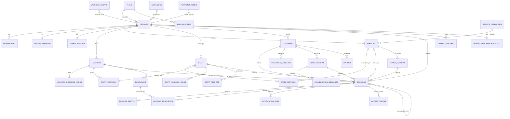

# Totalmobi Booking — Modelo de dados

> Versão 1.0 — 2026-08-17.
> Projeto Supabase: `ulpsaxhocvezcohbndpz` · PostgreSQL **17.6** · schema **`booking`**.
> Este documento descreve o modelo **alvo completo**. As migrations criam-no por
> milestone — ver [IMPLEMENTATION_PLAN.md](IMPLEMENTATION_PLAN.md).

---

## 1. Convenções

| Regra | Valor |
|---|---|
| Schema | `booking` — nunca `public`. O `public` é do Totalmobi CMS (`tot_*`). |
| Nomes | `snake_case`, tabelas no **plural**, colunas em **inglês** |
| Chaves | `uuid` com `gen_random_uuid()` (pgcrypto, nativo no PG 17) |
| Tempo | `timestamptz` sempre. Horários locais recorrentes usam `time` + `weekday` |
| Dinheiro | `numeric(12,2)` + `currency char(3)`. Nunca `float` |
| Telefone | E.164 normalizado (`+351912345678`) na coluna `*_e164` |
| Auditoria | `created_at`, `updated_at` em todas as tabelas de negócio |
| Apagar | Soft delete (`archived_at`) no que é referenciado historicamente |
| RLS | **Todas** as tabelas: `ENABLE` + `FORCE ROW LEVEL SECURITY`, na mesma migration da criação |
| Migrations | `NNNN_nome.sql`, idempotentes, aditivas, nunca editadas depois de aplicadas |

> **Porquê `FORCE`:** sem ele, o dono da tabela ignora as políticas. Como a
> migration corre como `postgres`, sem `FORCE` seria fácil testar com o papel
> errado e concluir que o isolamento funciona quando não funciona.

---

## 2. Diagrama de entidades



---

## 3. Enums

```sql
CREATE TYPE booking.tenant_status AS ENUM
  ('trial','active','past_due','suspended','cancelled');

CREATE TYPE booking.member_role AS ENUM
  ('tenant_admin','manager','staff');
  -- super_admin NÃO está aqui: não é um papel dentro de um tenant.
  -- Vive em booking.platform_admins. Ver secção 4.2.

CREATE TYPE booking.booking_status AS ENUM
  ('pending','awaiting_confirmation','confirmed','checked_in','in_progress',
   'completed','cancelled_customer','cancelled_business','no_show','rescheduled');

CREATE TYPE booking.booking_source AS ENUM
  ('public_web','widget','whatsapp','voice','admin','api','import');

CREATE TYPE booking.notification_channel AS ENUM
  ('whatsapp','email','sms','push');

CREATE TYPE booking.notification_type AS ENUM
  ('booking_created','booking_confirmed','reminder','cancelled','rescheduled',
   'changed_by_business','follow_up','waitlist_offer','no_show_followup');

CREATE TYPE booking.notification_status AS ENUM
  ('pending','processing','sent','delivered','read','failed','cancelled');

CREATE TYPE booking.conversation_channel AS ENUM
  ('whatsapp','web_chat','instagram','messenger','voice');

CREATE TYPE booking.conversation_state AS ENUM
  ('NEW','IDENTIFYING_INTENT','SELECTING_LOCATION','SELECTING_SERVICE',
   'SELECTING_STAFF','SELECTING_DATE','SELECTING_SLOT',
   'COLLECTING_CUSTOMER_DATA','CONFIRMING','BOOKED','MANAGING_BOOKING',
   'WAITING_HUMAN','HUMAN','BOT_RESUMED','CLOSED');

CREATE TYPE booking.message_direction AS ENUM ('inbound','outbound');

CREATE TYPE booking.webhook_status AS ENUM
  ('received','processing','processed','failed','skipped');

CREATE TYPE booking.time_off_kind AS ENUM
  ('vacation','sick_leave','holiday','block','training','other');

CREATE TYPE booking.resource_kind AS ENUM
  ('room','chair','equipment','vehicle','other');

CREATE TYPE booking.waitlist_status AS ENUM
  ('active','offered','converted','expired','cancelled');

CREATE TYPE booking.actor_type AS ENUM
  ('user','customer','system','bot','platform_admin');
```

---

## 4. Núcleo multi-tenant (Milestone 1)

### 4.1 `tenants`

| Coluna | Tipo | Notas |
|---|---|---|
| `id` | `uuid` PK | |
| `slug` | `text` UNIQUE | usado no URL público; `CHECK (slug ~ '^[a-z0-9][a-z0-9-]{1,48}[a-z0-9]$')` |
| `code` | `text` UNIQUE | `TMB0001`, gerado por sequência — alinha com a convenção `TOT0xx` do CMS |
| `legal_name` | `text` | |
| `display_name` | `text` NOT NULL | o nome que o cliente final vê |
| `segment` | `text` | `dental`, `barbershop`, `vet`… — informativo, **não** condiciona lógica |
| `status` | `tenant_status` | default `trial` |
| `plan_code` | `text` FK → `plans` | |
| `email`, `phone_e164`, `whatsapp_phone_e164`, `website` | `text` | |
| `tax_id`, `country_code` | `text` | ISO-3166-1 alpha-2 |
| `default_timezone` | `text` | IANA. Omissão para novas unidades; a verdade é a da `location` |
| `default_locale` | `text` | `pt-PT`, `pt-BR`, `en` |
| `default_currency` | `char(3)` | ISO-4217 |
| `custom_domain` | `text` UNIQUE NULL | `agenda.clinicadente.pt` |
| `trial_ends_at`, `suspended_at`, `archived_at` | `timestamptz` | |
| `created_at`, `updated_at` | `timestamptz` | |

`CHECK`: `custom_domain` só é permitido com `status IN ('active','trial')`.

### 4.2 `platform_admins` — porque não é um `member_role`

O super admin da Totalmobi **não pertence a nenhum tenant**. Modelá-lo como uma
linha em `memberships` obrigaria a criar N linhas por cada tenant novo, e um
esquecimento tornar-se-ia num buraco de acesso silencioso.

```sql
CREATE TABLE booking.platform_admins (
  user_id     uuid PRIMARY KEY REFERENCES auth.users(id) ON DELETE CASCADE,
  email       text NOT NULL CHECK (email = lower(email)),
  can_impersonate boolean NOT NULL DEFAULT false,
  created_at  timestamptz NOT NULL DEFAULT now(),
  created_by  uuid REFERENCES auth.users(id)
);
```

**Esta tabela não tem política de escrita — nem para o próprio.** Ninguém se
promove pela aplicação; acrescentar um admin exige SQL direto. É o mesmo padrão
deliberado usado em `golf.operador` no projeto da ABGS, e a razão é a mesma:
o pool `auth.users` é partilhado com milhares de contas de clientes do CMS.

### 4.3 `memberships`

```sql
CREATE TABLE booking.memberships (
  id          uuid PRIMARY KEY DEFAULT gen_random_uuid(),
  tenant_id   uuid NOT NULL REFERENCES booking.tenants(id) ON DELETE CASCADE,
  user_id     uuid NOT NULL REFERENCES auth.users(id) ON DELETE CASCADE,
  role        booking.member_role NOT NULL,
  staff_id    uuid REFERENCES booking.staff(id) ON DELETE SET NULL,
  location_ids uuid[] NOT NULL DEFAULT '{}',   -- vazio = todas as unidades
  invited_by  uuid REFERENCES auth.users(id),
  accepted_at timestamptz,
  archived_at timestamptz,
  created_at  timestamptz NOT NULL DEFAULT now(),
  updated_at  timestamptz NOT NULL DEFAULT now(),
  UNIQUE (tenant_id, user_id)
);
```

`memberships` é a **única** fonte de autorização dentro de um tenant. Um JWT
`authenticated` sem linha aqui não vê absolutamente nada.

### 4.4 `locations`

`id`, `tenant_id`, `name`, `slug`, `address_line1/2`, `postal_code`, `city`,
`country_code`, `timezone` (IANA, **NOT NULL** — é aqui que o fuso vive),
`phone_e164`, `whatsapp_phone_e164`, `email`, `latitude`, `longitude`,
`is_active`, `is_default`, `sort_order`, `archived_at`, timestamps.

`UNIQUE (tenant_id, slug)` · índice parcial garante **uma só** `is_default` por tenant.

### 4.5 `audit_logs`

`id bigint` (identity — a ordem importa e é o único sítio onde um sequencial é
melhor que um uuid), `tenant_id` (NULL para ações da plataforma),
`actor_type booking.actor_type`, `actor_user_id`, `actor_label`, `action`,
`entity`, `entity_id`, `old_values jsonb`, `new_values jsonb`, `source`,
`ip inet`, `user_agent`, `request_id`, `created_at`.

Só se escreve por `service_definer`; ninguém faz `UPDATE`/`DELETE` aqui —
não há políticas para essas operações, em tenant nenhum.

Índices: `(tenant_id, created_at DESC)`, `(tenant_id, entity, entity_id)`.

---

## 5. Catálogo e equipa (Milestone 5)

### `services`
`id`, `tenant_id`, `category_id`, `name`, `slug`, `description`,
`duration_minutes` (`CHECK > 0`), `buffer_before_minutes`,
`buffer_after_minutes`, `price numeric(12,2)`, `promo_price`, `currency`,
`capacity int NOT NULL DEFAULT 1 CHECK (capacity >= 1)`,
`is_active`, `bookable_online`, `requires_confirmation`, `color`, `image_url`,
`sort_order`, `min_advance_minutes`, `max_advance_days`,
`cancellation_min_hours`, `reschedule_min_hours` (NULL ⇒ herda de
`tenant_policies`), `archived_at`, timestamps.

> As políticas em três níveis — plataforma → tenant → serviço — resolvem-se com
> `COALESCE(service.x, tenant_policy.x, default)`. Uma limpeza dentária e uma
> cirurgia não podem ter a mesma antecedência de cancelamento.

### `staff`
`id`, `tenant_id`, `user_id` (NULL — nem todo o profissional tem login),
`full_name`, `photo_url`, `job_title`, `bio`, `email`, `phone_e164`,
`is_active`, `accepts_online_booking`, `calendar_color`, `priority int`,
`concurrent_capacity int DEFAULT 1`, `timezone` (NULL ⇒ o da unidade),
`sort_order`, `archived_at`, timestamps.

### `staff_services`
`staff_id`, `service_id`, `duration_minutes_override`, `price_override`,
`is_active`. PK composta. Duração e preço específicos por profissional — a
sénior leva mais caro e demora menos.

### `staff_locations`
`staff_id`, `location_id`, `is_primary`. PK composta.

---

## 6. Tempo e disponibilidade (Milestone 6)

### `location_business_hours`
`location_id`, `weekday smallint CHECK (0..6)` (0 = domingo, alinhado com
`EXTRACT(DOW)`), `opens_at time`, `closes_at time`, `is_closed boolean`.
Várias linhas por dia = vários períodos (fecho para almoço).
`CHECK (opens_at < closes_at)`.

### `staff_working_hours`
`staff_id`, `location_id`, `weekday`, `starts_at time`, `ends_at time`,
`valid_from date`, `valid_until date` (NULL = sem fim).
As datas de validade permitem "a partir de setembro passo a trabalhar às
sextas" sem apagar o histórico que explica marcações antigas.

### `schedule_exceptions`
Fechos e aberturas extraordinárias, ao nível do tenant, da unidade **ou** do
profissional (exatamente um dos três `*_id` preenchido, imposto por `CHECK`).
`date`, `starts_at time` NULL, `ends_at time` NULL, `kind` (`closed`/`open`),
`reason`. `starts_at` NULL + `kind='closed'` = dia inteiro fechado.

### `staff_time_off`
`staff_id`, `starts_at timestamptz`, `ends_at timestamptz`, `kind time_off_kind`,
`reason`, `is_all_day`, `approved_by`, `created_at`.
Constraint de exclusão para impedir férias sobrepostas do mesmo profissional.

### Ordem de precedência do motor

```
schedule_exceptions (kind='closed')   ← ganha sempre
  > staff_time_off
  > schedule_exceptions (kind='open')
  > staff_working_hours ∩ location_business_hours
```

---

## 7. Marcações (Milestone 7)

### 7.1 A tabela

```sql
CREATE TABLE booking.bookings (
  id                    uuid PRIMARY KEY DEFAULT gen_random_uuid(),
  tenant_id             uuid NOT NULL REFERENCES booking.tenants(id) ON DELETE CASCADE,
  location_id           uuid NOT NULL REFERENCES booking.locations(id) ON DELETE RESTRICT,
  customer_id           uuid NOT NULL REFERENCES booking.customers(id) ON DELETE RESTRICT,
  service_id            uuid NOT NULL REFERENCES booking.services(id) ON DELETE RESTRICT,
  staff_id              uuid          REFERENCES booking.staff(id)    ON DELETE RESTRICT,
  group_session_id      uuid          REFERENCES booking.group_sessions(id) ON DELETE RESTRICT,

  start_at              timestamptz NOT NULL,
  end_at                timestamptz NOT NULL,
  timezone              text        NOT NULL,   -- o fuso em vigor à data da marcação
  buffer_before_minutes int NOT NULL DEFAULT 0,
  buffer_after_minutes  int NOT NULL DEFAULT 0,

  -- mantido por trigger; ver 7.2
  blocked_range         tstzrange NOT NULL,
  occupies_slot         boolean GENERATED ALWAYS AS (
                          status IN ('pending','awaiting_confirmation','confirmed',
                                     'checked_in','in_progress','completed')
                        ) STORED,

  status                booking.booking_status NOT NULL DEFAULT 'pending',
  source                booking.booking_source NOT NULL,
  conversation_id       uuid REFERENCES booking.conversations(id) ON DELETE SET NULL,
  rescheduled_from_id   uuid REFERENCES booking.bookings(id) ON DELETE SET NULL,

  price                 numeric(12,2),
  currency              char(3),
  notes                 text,           -- escrito pelo cliente
  internal_notes        text,           -- nunca visível ao cliente
  cancellation_reason   text,

  idempotency_key       text,
  external_reference    text,

  created_by            uuid REFERENCES auth.users(id),
  confirmed_at          timestamptz,
  checked_in_at         timestamptz,
  completed_at          timestamptz,
  cancelled_at          timestamptz,
  no_show_at            timestamptz,
  created_at            timestamptz NOT NULL DEFAULT now(),
  updated_at            timestamptz NOT NULL DEFAULT now(),

  CONSTRAINT bookings_time_order CHECK (end_at > start_at),
  CONSTRAINT bookings_staff_or_group CHECK (staff_id IS NOT NULL OR group_session_id IS NOT NULL)
);
```

### 7.2 Porque `blocked_range` é trigger e não coluna gerada

A tentação óbvia é:

```sql
blocked_range tstzrange GENERATED ALWAYS AS (
  tstzrange(start_at - make_interval(mins => buffer_before_minutes), …)
) STORED   -- ✗ NÃO FUNCIONA
```

Não compila. Em PostgreSQL, `timestamptz + interval` é **`STABLE`, não
`IMMUTABLE`** — o resultado depende do `TimeZone` da sessão para intervalos com
componente de dia/mês, por causa do horário de verão. Colunas geradas só aceitam
expressões imutáveis.

A solução é um trigger `BEFORE INSERT OR UPDATE` que calcula a coluna. O
`occupies_slot`, esse, pode ser gerado: comparação de enums é imutável.

```sql
CREATE FUNCTION booking.tg_bookings_set_range() RETURNS trigger
LANGUAGE plpgsql AS $$
BEGIN
  NEW.blocked_range := tstzrange(
    NEW.start_at - (NEW.buffer_before_minutes || ' minutes')::interval,
    NEW.end_at   + (NEW.buffer_after_minutes  || ' minutes')::interval,
    '[)'
  );
  RETURN NEW;
END $$;
```

Intervalo `'[)'` — semiaberto. Uma marcação das 10:00 às 10:30 e outra das 10:30
às 11:00 **não** se sobrepõem. Com `'[]'` estariam em conflito e metade da
agenda ficaria por preencher.

### 7.3 A constraint que impede double booking

```sql
CREATE EXTENSION IF NOT EXISTS btree_gist;

ALTER TABLE booking.bookings
  ADD CONSTRAINT bookings_no_staff_overlap
  EXCLUDE USING gist (staff_id WITH =, blocked_range WITH &&)
  WHERE (occupies_slot AND staff_id IS NOT NULL AND group_session_id IS NULL);
```

`btree_gist` é o que permite pôr um `uuid` com operador `=` dentro de um índice
GiST ao lado de um `range` com `&&`. Sem ele, a constraint não é criável.

Aulas de grupo estão excluídas do predicado — dez pessoas na mesma sessão de
Pilates com a mesma professora não são um conflito. Ver secção 8.

Violação devolve `SQLSTATE 23P01`, traduzido pela aplicação para `SLOT_TAKEN`.

### 7.4 Índices

```sql
CREATE UNIQUE INDEX bookings_idempotency_uk
  ON booking.bookings (tenant_id, idempotency_key)
  WHERE idempotency_key IS NOT NULL;

CREATE INDEX bookings_tenant_start_idx  ON booking.bookings (tenant_id, start_at DESC);
CREATE INDEX bookings_staff_start_idx   ON booking.bookings (staff_id, start_at)
  WHERE occupies_slot;
CREATE INDEX bookings_customer_idx      ON booking.bookings (customer_id, start_at DESC);
CREATE INDEX bookings_location_day_idx  ON booking.bookings (location_id, start_at)
  WHERE occupies_slot;
CREATE INDEX bookings_status_idx        ON booking.bookings (tenant_id, status, start_at);
```

Os índices parciais em `occupies_slot` são os que interessam: o motor de
disponibilidade só olha para marcações vivas, e ao fim de um ano a maioria das
linhas já está cancelada ou completa.

### 7.5 `booking_events` — o histórico

`id bigint`, `booking_id`, `tenant_id`, `event_type` (`created`, `confirmed`,
`rescheduled`, `cancelled`, `no_show`, `moved_by_admin`, `staff_changed`,
`reminder_sent`), `actor_type`, `actor_user_id`, `from_values jsonb`,
`to_values jsonb`, `source`, `created_at`.

Remarcar **nunca** faz `UPDATE` do horário. Cria uma marcação nova com
`rescheduled_from_id`, muda a antiga para `rescheduled`, e escreve o evento nas
duas. É assim que a pergunta "esta consulta já foi mudada quantas vezes, por
quem e por que canal?" tem resposta.

---

## 8. Capacidade e serviços de grupo

```sql
CREATE TABLE booking.group_sessions (
  id           uuid PRIMARY KEY DEFAULT gen_random_uuid(),
  tenant_id    uuid NOT NULL REFERENCES booking.tenants(id) ON DELETE CASCADE,
  location_id  uuid NOT NULL REFERENCES booking.locations(id),
  service_id   uuid NOT NULL REFERENCES booking.services(id),
  staff_id     uuid          REFERENCES booking.staff(id),
  start_at     timestamptz NOT NULL,
  end_at       timestamptz NOT NULL,
  blocked_range tstzrange NOT NULL,          -- trigger, como em bookings
  capacity     int NOT NULL CHECK (capacity >= 1),
  booked_count int NOT NULL DEFAULT 0,
  is_cancelled boolean NOT NULL DEFAULT false,
  CONSTRAINT group_capacity_not_exceeded CHECK (booked_count <= capacity)
);
```

A constraint de exclusão não serve aqui — o objetivo é precisamente permitir
várias marcações no mesmo intervalo. A garantia é outra:

1. `UPDATE booking.group_sessions SET booked_count = booked_count + 1 WHERE id = $1`
   — o `UPDATE` bloqueia a linha e serializa os concorrentes.
2. O `CHECK (booked_count <= capacity)` recusa o décimo primeiro inscrito numa
   turma de dez.

O professor não pode dar duas aulas ao mesmo tempo — isso garante-se com uma
constraint de exclusão na própria `group_sessions`.

---

## 9. Recursos — salas e equipamentos (Milestone MVP 2)

```sql
CREATE TABLE booking.resources (
  id uuid PRIMARY KEY, tenant_id uuid, location_id uuid,
  name text, kind booking.resource_kind, capacity int DEFAULT 1, is_active boolean
);

CREATE TABLE booking.booking_resources (
  booking_id    uuid REFERENCES booking.bookings(id) ON DELETE CASCADE,
  resource_id   uuid REFERENCES booking.resources(id) ON DELETE RESTRICT,
  blocked_range tstzrange NOT NULL,   -- espelhado da booking por trigger
  occupies_slot boolean   NOT NULL,   -- idem
  PRIMARY KEY (booking_id, resource_id),
  EXCLUDE USING gist (resource_id WITH =, blocked_range WITH &&)
    WHERE (occupies_slot)
);
```

O espelhamento de `blocked_range`/`occupies_slot` é redundância deliberada: uma
constraint de exclusão só consegue olhar para colunas da própria tabela. O
trigger em `bookings` propaga qualquer alteração de horário ou estado.

A tabela existe no schema desde cedo mesmo sem UI. Acrescentar
`booking_resources` a uma base com marcações reais obrigaria a preencher o
histórico às cegas.

---

## 10. Clientes e RGPD

### `customers`
`id`, `tenant_id`, `first_name`, `last_name`, `phone_e164`,
`whatsapp_phone_e164`, `email text` (normalizado para minúsculas), `locale`,
`timezone`, `birth_date`,
`notes`, `tags text[]`, `is_blocked`, `blocked_reason`,
`anonymized_at timestamptz`, timestamps.

```sql
CREATE UNIQUE INDEX customers_tenant_phone_uk
  ON booking.customers (tenant_id, phone_e164)
  WHERE phone_e164 IS NOT NULL AND anonymized_at IS NULL;
```

O cliente é **por tenant**. A Maria da clínica dentária e a Maria do
cabeleireiro são duas linhas, ainda que seja a mesma pessoa com o mesmo número.
Uma tabela global de pessoas seria uma fuga de dados entre empresas por
construção — e o RGPD não perdoaria.

### `customer_consents`
`customer_id`, `purpose` (`reminders`, `marketing`, `terms`, `privacy_policy`),
`granted boolean`, `granted_at`, `revoked_at`, `source`, `ip`, `evidence jsonb`.

Consentimento é um **registo de eventos**, não uma coluna booleana. A pergunta
que o RGPD faz é "prove que ela consentiu, quando e como" — e uma coluna `true`
não prova nada.

### Anonimização

`booking.anonymize_customer(customer_id)` substitui nome, telefone e email por
marcadores, apaga `notes`, escreve `anonymized_at`, e **preserva as marcações**
(o negócio tem obrigação fiscal e estatística de as manter). Direito ao
apagamento sem destruir a integridade contabilística.

---

## 11. Notificações

### `notification_jobs`
`id`, `tenant_id`, `booking_id`, `customer_id`, `channel`, `type`,
`scheduled_for timestamptz`, `status`, `attempts int`, `last_attempt_at`,
`sent_at`, `provider_message_id`, `payload jsonb`, `error text`,
`locked_at`, `locked_by`.

```sql
CREATE UNIQUE INDEX notification_jobs_dedupe_uk
  ON booking.notification_jobs (booking_id, type, channel, scheduled_for);

CREATE INDEX notification_jobs_due_idx
  ON booking.notification_jobs (scheduled_for)
  WHERE status = 'pending';
```

O índice único **é** a idempotência. O planeador insere com
`ON CONFLICT DO NOTHING`; correr duas vezes não duplica nada.

O worker drena com `FOR UPDATE SKIP LOCKED LIMIT 50`.

### `notification_templates`
Por tenant, canal, tipo e idioma. Guarda o nome do template aprovado na Meta e
o estado de aprovação — um lembrete WhatsApp fora da janela de 24 h só sai com
template aprovado.

---

## 12. Conversas

`conversations`: `tenant_id`, `customer_id`, `channel`, `external_id`
(`wa_id`), `status`, `current_state conversation_state`, `context jsonb`,
`assigned_user_id`, `last_message_at`, `bot_paused_until`, timestamps.
`UNIQUE (tenant_id, channel, external_id)` para conversas abertas.

`conversation_messages`: `conversation_id`, `direction`,
`provider_message_id UNIQUE`, `type` (`text`/`interactive`/`audio`/`image`),
`text`, `structured_payload jsonb`, `ai_intent jsonb`, `status`, `sent_at`,
`delivered_at`, `read_at`.

`context` guarda o que a conversa já sabe (serviço escolhido, data, slots
oferecidos). É o que permite a máquina de estados saltar passos — e o que se
volta a ler quando o cliente responde três horas depois.

---

## 13. Integrações e webhooks

### `tenant_whatsapp_accounts`
`tenant_id` (UNIQUE), `waba_id`, `phone_number_id` (UNIQUE — resolve o tenant no
webhook), `display_phone_number`, `business_id`,
`access_token_encrypted bytea`, `token_key_id`, `verified_name`, `status`,
`quality_rating`, `messaging_limit`, `webhook_verified_at`, `connected_at`,
`last_error`.

**O token nunca é legível por RLS.** A tabela não tem política de `SELECT` para
papel nenhum: só o `service_role`, dentro do worker, lhe toca. Ver
[SECURITY.md](SECURITY.md#6-tokens-de-integração).

### `webhook_events`
`id`, `provider`, `external_event_id`, `tenant_id` (resolvido, pode ser NULL),
`payload jsonb`, `signature_valid boolean`, `status webhook_status`,
`attempts`, `received_at`, `processed_at`, `error`.

```sql
CREATE UNIQUE INDEX webhook_events_provider_event_uk
  ON booking.webhook_events (provider, external_event_id);
```

A Meta reenvia eventos quando não recebe `200` a tempo. Sem este índice, um
cliente pode receber a mesma mensagem várias vezes — ou pior, marcar duas.

---

## 14. Planos e feature flags

`plans` (`code` PK, `name`, `monthly_price`, `currency`, `is_public`,
`sort_order`) · `features` (`key` PK, `name`, `description`) ·
`plan_features` (`plan_code`, `feature_key`) ·
`tenant_features` (`tenant_id`, `feature_key`, `enabled boolean`, `note`).

Resolução: `tenant_features` **sobrepõe-se** a `plan_features`.
Chaves iniciais: `whatsapp`, `chatbot_ai`, `voice`, `multi_location`,
`resources`, `payments`, `advanced_reports`, `custom_domain`, `api_access`,
`waitlist`, `group_sessions`.

Nenhum `if (plan === 'premium')` no código. Sempre
`hasFeature(tenantId, 'whatsapp')`.

---

## 15. Links tokenizados para o cliente final

```sql
CREATE TABLE booking.access_tokens (
  id          uuid PRIMARY KEY DEFAULT gen_random_uuid(),
  tenant_id   uuid NOT NULL REFERENCES booking.tenants(id) ON DELETE CASCADE,
  token_hash  bytea NOT NULL UNIQUE,        -- SHA-256. O token em claro nunca é guardado.
  purpose     text  NOT NULL,               -- manage_booking | confirm | cancel
  booking_id  uuid REFERENCES booking.bookings(id) ON DELETE CASCADE,
  customer_id uuid REFERENCES booking.customers(id) ON DELETE CASCADE,
  expires_at  timestamptz NOT NULL,
  used_at     timestamptz,
  max_uses    int NOT NULL DEFAULT 20,
  use_count   int NOT NULL DEFAULT 0,
  created_at  timestamptz NOT NULL DEFAULT now()
);
```

É isto que substitui a conta de utilizador do cliente final. Guarda-se o hash,
não o token: quem leia a base de dados não consegue aceder às marcações de
ninguém. Expira, tem limite de utilizações, e é revogado quando a marcação
termina.

---

## 16. Funções auxiliares de RLS

```sql
-- Devolve os tenants a que o utilizador da sessão pertence.
-- STABLE + SECURITY DEFINER: lê memberships contornando a RLS da própria
-- memberships, o que evitaria recursão infinita.
CREATE FUNCTION booking.current_tenant_ids() RETURNS uuid[]
LANGUAGE sql STABLE SECURITY DEFINER SET search_path = booking, pg_catalog AS $$
  SELECT COALESCE(array_agg(tenant_id), '{}')
  FROM booking.memberships
  WHERE user_id = auth.uid() AND archived_at IS NULL AND accepted_at IS NOT NULL;
$$;

CREATE FUNCTION booking.is_platform_admin() RETURNS boolean
LANGUAGE sql STABLE SECURITY DEFINER SET search_path = booking, pg_catalog AS $$
  SELECT EXISTS (SELECT 1 FROM booking.platform_admins WHERE user_id = auth.uid());
$$;

CREATE FUNCTION booking.has_tenant_role(p_tenant uuid, p_roles booking.member_role[])
RETURNS boolean
LANGUAGE sql STABLE SECURITY DEFINER SET search_path = booking, pg_catalog AS $$
  SELECT EXISTS (
    SELECT 1 FROM booking.memberships
    WHERE tenant_id = p_tenant AND user_id = auth.uid()
      AND role = ANY (p_roles) AND archived_at IS NULL AND accepted_at IS NOT NULL
  );
$$;
```

### O padrão de política — e porque a forma importa

```sql
-- ✓ CORRETO E RÁPIDO — a função corre uma vez por query (InitPlan)
USING (tenant_id = ANY ((SELECT booking.current_tenant_ids())::uuid[]))

-- ✗ NÃO COMPILA — erro 42883: operator does not exist: uuid = uuid[]
USING (tenant_id = ANY ((SELECT booking.current_tenant_ids())))

-- ✗ LENTO — a função corre uma vez POR LINHA
USING (booking.user_has_access(tenant_id))
```

**O `::uuid[]` não é cosmético.** Sem ele, o PostgreSQL lê `ANY (subselect)`
como a forma *subquery* de `ANY`, que espera um conjunto de `uuid`, e a função
devolve um `uuid[]` — daí o `42883`. O cast transforma o parêntesis numa
expressão, o que força a forma *array*, que é a que queremos. Custou uma
migration falhada a descobrir.

Envolver a chamada em `(SELECT …)` sem referência a colunas da linha faz o
planeador avaliá-la como `InitPlan`, uma única vez. Confirmado com `EXPLAIN`
contra a base de dados real:

```text
Aggregate
  InitPlan 1
    ->  Result
  ->  Bitmap Heap Scan on tenants
        Recheck Cond: (id = ANY ((InitPlan 1).col1))
        ->  Bitmap Index Scan on tenants_pkey
              Index Cond: (id = ANY ((InitPlan 1).col1))
```

A alternativa `tenant_id IN (SELECT unnest(...))` também funciona e também
avalia uma vez, mas produz um `Nested Loop` com `HashAggregate` em vez de usar
o índice diretamente. Todas as políticas deste schema seguem a primeira forma.

`SET search_path` fixo em todas as funções `SECURITY DEFINER` — sem isso, um
utilizador com permissão de criar objetos podia sequestrar a resolução de nomes.

### Grants

```sql
GRANT USAGE ON SCHEMA booking TO anon, authenticated, service_role;
-- Sem GRANT ALL. Cada tabela recebe o mínimo, explicitamente.

Esta decisão tem um custo que vale a pena dizer em voz alta: **esquecer um grant
não dá erro nenhum**. A migration aplica-se, a tabela existe, e a falha aparece
mais tarde, em produção, na primeira escrita — `42501 permission denied`.

Aconteceu na `0034`. As tabelas de subscrição nasceram sem privilégios para o
`service_role`; o webhook do Stripe respondia 500 a todos os eventos e a tabela
de diagnóstico ficava vazia, porque escrever nela era precisamente o que
falhava. Corrigido na `0035`.

O RLS não tapa este buraco: **uma política só é consultada depois de a role ter
direito à tabela**. O `service_role` ignora RLS, mas não ignora `grant`.

A guarda está em `packages/database/tests/grants-das-migracoes.test.ts`: lê as
migrations e exige um grant de `service_role` por cada tabela criada em
`booking`.
-- anon: SELECT apenas em tenants/locations/services/staff públicos.
```

---

## 17. `create_booking_atomic`

Assinatura (detalhe no Milestone 7):

```sql
CREATE FUNCTION booking.create_booking_atomic(p_payload jsonb)
RETURNS booking.bookings
LANGUAGE plpgsql SECURITY DEFINER SET search_path = booking, pg_catalog AS $$
```

Sequência interna, por ordem:

1. `idempotency_key` já existe ⇒ devolve a marcação existente, sem efeitos.
2. Valida que o tenant está ativo e o serviço é `bookable_online` (se a origem
   não for `admin`).
3. `pg_advisory_xact_lock(hashtextextended(tenant||staff||dia, 0))` — serializa
   os concorrentes ao mesmo profissional no mesmo dia.
4. Revalida disponibilidade **dentro da transação**: horário, exceções, férias,
   antecedência mínima e máxima.
5. `INSERT` — a constraint de exclusão é a última linha de defesa.
6. `INSERT` em `booking_events` e `audit_logs`.
7. Planeia `notification_jobs`.

`EXCEPTION WHEN exclusion_violation THEN RAISE EXCEPTION 'SLOT_TAKEN' USING ERRCODE = 'P0001'`.

Ser `SECURITY DEFINER` obriga a função a validar ela própria a autorização:
`booking.has_tenant_role(...)` para origem `admin`, ou o caminho público
verificado quando a origem é `public_web`/`whatsapp`. Uma função `SECURITY
DEFINER` sem essa verificação é um bypass de RLS com um nome bonito.

---

## 18. Estado de validação das migrations

**Aplicadas e verificadas em produção a 2026-08-17.** Migrations 0001–0007 no
projeto `ulpsaxhocvezcohbndpz`.

| Estado | Valor |
|---|---|
| Tabelas em `booking` | 12 |
| Políticas RLS | 25 |
| Funções `SECURITY DEFINER` | 10, todas com `search_path` fixo |
| Tenants de demonstração | 2 (Clínica Sorriso, Studio Bella) |
| Unidades | 3 |
| Verificações de RLS | **19/19 passaram** |
| Tabelas do CMS em `public` | 36, **intactas** |
| Contas em `auth.users` | 15, **nenhuma criada nem alterada** |

As verificações correram dentro de uma transação terminada em `ROLLBACK`, com
contas reais já existentes — nada foi escrito em `auth.users` e não sobrou uma
linha dos memberships temporários.

### O que a execução revelou que a revisão não

Três coisas passaram no analisador de sintaxe e falharam na base de dados. É a
justificação empírica para o critério de aceite exigir execução, não leitura.

1. **`= ANY ((SELECT f()))` não compila** — erro `42883`,
   `operator does not exist: uuid = uuid[]`. Falta o `::uuid[]`; sem ele o
   PostgreSQL lê a forma *subquery* de `ANY` em vez da forma *array*.
   Corrigido em 22 políticas antes da 0006 aplicar.
2. **Fuga entre tenants nas políticas `*_member_read`** — o administrador de um
   tenant via unidades de outro, por causa de uma cláusula
   `or is_tenant_public(tenant_id)` que eu próprio lá tinha posto. Corrigido na
   migration 0007, com guarda permanente contra a reintrodução.
3. **Corrupção de UTF-8 no seed** — o `í` de "Clínica" foi gravado como `EF BF
   BD` (U+FFFD). A culpa era da ferramenta que passava o SQL por variável de
   ambiente do shell em Windows, não do SQL. Dados reescritos e verificados
   byte a byte.

O que **confirmou-se** como estava previsto: `postgres` tem `BYPASSRLS`, logo as
funções `SECURITY DEFINER` escapam à RLS e não há recursão nas políticas de
`memberships`; as `CHECK` com `booking.is_valid_timezone()` são aceites; e os
privilégios de coluna da `anon` bastam para as políticas de `tenants`.

---

## 19. Como aplicar as migrations

1. **Management API com token de gestão** — o caminho usado. Gerar o token em
   `supabase.com/dashboard/account/tokens` e fazer `POST` a
   `/v1/projects/{ref}/database/query`.

   ⚠️ **Ler o ficheiro SQL dentro do processo que faz o pedido.** Passar o
   conteúdo por variável de ambiente ou por substituição do shell corrompe os
   acentos em Windows, em silêncio e de forma irreversível. Foi assim que
   "Clínica" ficou gravado com U+FFFD.

   ⚠️ O endpoint corre cada pedido numa transação: uma migration que falhe a
   meio faz rollback completo, sem estado parcial. Confirmado — a 0006 falhou à
   primeira e não deixou uma única política para trás.

2. **SQL Editor do dashboard** — colar o conteúdo. Funciona sempre; é o caminho
   quando não há token à mão.

3. **Local, para desenvolvimento e testes** — `supabase start` (Docker) e
   `supabase db reset`. É contra esta base local que devem correr os testes de
   concorrência do Milestone 8; **nunca** contra produção.

### Expor o schema na Data API — **feito**

`db_schema` está em `public,graphql_public,booking` desde 2026-08-17.

Foi alterado pela **Management API** (`PATCH /v1/projects/{ref}/postgrest`) e
**funcionou de imediato**, sem precisar de Save no dashboard: a `booking.tenants`
passou a responder `200` na REST logo a seguir.

> Isto contradiz o que ficou registado do projeto da ABGS, onde a mesma
> alteração gravava a configuração mas não reiniciava o PostgREST. Ou o
> comportamento mudou, ou era específico daquele projeto. **Verificar sempre em
> vez de assumir**; se um dia o `PATCH` não pegar, o caminho seguro continua a
> ser Dashboard → Integrations → Data API → Settings → Exposed schemas → Save.

O `PATCH` é destrutivo: substitui a lista toda. Enviar sempre o valor completo
com os schemas existentes incluídos — apagar `public` deste projeto derrubaria
a API do Totalmobi CMS, que serve apps em produção. Depois de alterar, confirmar
que `public` e `graphql_public` continuam lá **e** que a REST do CMS responde.

E confirmar que **"Automatically expose new tables" está ligado** neste projeto
(está). É por isso que a regra "`ENABLE` + `FORCE ROW LEVEL SECURITY` na mesma
migration que cria a tabela" não é estilo — é o que impede uma tabela nova de
ficar exposta sem políticas durante o intervalo entre duas migrations.

---

## 20. O que ainda falta decidir

| Questão | Quando | Nota |
|---|---|---|
| `pg_cron` e `pg_net` estão ativos neste projeto? | Milestone 12 | Requer verificação no dashboard. Alternativa: Vercel Cron |
| Particionar `audit_logs` e `conversation_messages` por mês | Quando passarem de ~5 M linhas | Não antecipar |
| Retenção de `webhook_events` | Milestone 10 | Proposta: 90 dias, purga por `pg_cron` |
| Cifra dos tokens WhatsApp: `pgsodium`/Vault ou na aplicação | Milestone 10 | Confirmar o que o Supabase suporta hoje — não assumir |
| Recorrência de marcações | MVP 3 | O modelo já não a bloqueia: `recurrence_id` + `recurrence_rule` (RFC 5545) juntam-se sem alterar nada do existente |
